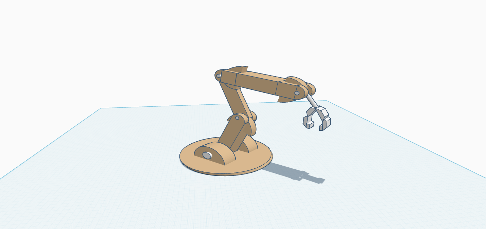

# Mechanical Task 1 – 5-DOF Robotic Arm Design

This project demonstrates the 3D design of a robotic arm with five degrees of freedom (5 DOF), created using Tinkercad. The arm simulates the structure and movement of a basic robotic manipulator.

## 🧠 Objective
Design a mechanical robotic arm composed of five joints to represent five independent movements (DOF), allowing realistic robotic motion.

## ⚙️ Degrees of Freedom Included
1. Base Rotation – Horizontal rotation of the entire arm  
2. Shoulder Joint – Up/down movement of the upper arm  
3. Elbow Joint – Extension/flexion of the lower arm  
4. Wrist Rotation – Twisting motion at the wrist  
5. Gripper – Opens and closes to hold objects (implemented using a socket part)

## 🛠 Tools Used
- Tinkercad (3D Design)
- Servo motor placeholders for movement simulation
- 3D shapes: Box, Cylinder, Socket, etc.

## 📂 Files Included
- mechanical-task1-robotic-arm.stl – STL file of the full robotic arm design  
- screenshot.png – Image preview of the arm as designed in Tinkercad  
- *(Optional)* README.md – This project description file

## 💡 Summary
This task is part of the Mechanical Track in the summer internship. The robotic arm design demonstrates understanding of robotic joint motion and 3D modeling using Tinkercad. The STL file can be viewed in any 3D software to explore the full structure.
